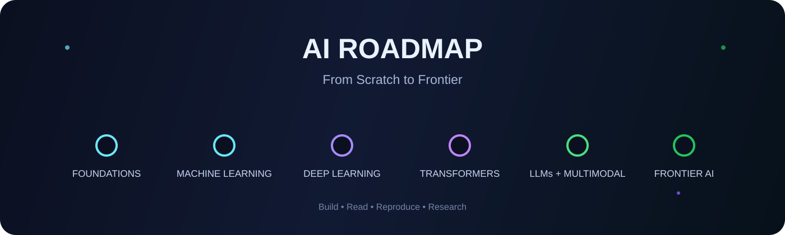

<p align="center">
  
</p>

<h1 align="center">AI Roadmap — From Scratch to Frontier</h1>

<p align="center">
  <strong>The research-oriented roadmap for learning Artificial Intelligence from first principles to modern frontier systems.</strong>
</p>

<p align="center">
  Python & Math · Machine Learning · Deep Learning · Computer Vision · NLP · Transformers · LLMs · RAG · Agents · Diffusion · Multimodal AI · RL · AI Systems · 3D & Embodied AI
</p>

<p align="center">
  <a href="#-start-here"><strong>Start Here</strong></a> ·
  <a href="#-choose-your-path"><strong>Choose a Path</strong></a> ·
  <a href="#-roadmap-dashboard"><strong>Roadmap</strong></a> ·
  <a href="#the-paper-ladder"><strong>Papers</strong></a> ·
  <a href="#the-project-ladder"><strong>Projects</strong></a> ·
  <a href="#resource-library"><strong>Resources</strong></a>
</p>

> **One roadmap. Four levels:** Beginner → Builder → Engineer → Researcher


---

## Why this roadmap?

AI changes quickly, but the foundations do not.

A strong AI engineer or researcher should understand more than how to call a model API. You should know how data becomes tensors, how gradients train neural networks, why attention works, how modern language and vision models are built, how they are adapted and evaluated, and how they are deployed efficiently.

This roadmap is designed as a **machine learning roadmap, deep learning roadmap, LLM roadmap, generative AI roadmap, computer vision roadmap, NLP roadmap, multimodal AI roadmap, AI agent roadmap, and AI research roadmap in one coherent path**.

The goal is not to learn every paper ever published. The goal is to build the mental model needed to understand new AI systems as they appear.


> ⭐ **Useful?** Star the repository to bookmark the roadmap and help other learners find it.

---

## 🚀 Start Here

This repository is designed to answer one question:

> **If I started learning AI today, what should I learn, in what order, what should I build, and which papers actually matter?**

You do **not** need to finish everything before building projects or applying for jobs. Pick a path, follow the foundations, and deepen only where your goal requires it.

<table>
<tr>
<td width="25%" valign="top">

### 01 · Foundations
Python, Git, Linux, NumPy, math, probability and optimization.

**Goal:** stop treating ML as magic.

</td>
<td width="25%" valign="top">

### 02 · Core AI
Classical ML, neural networks, PyTorch and experiment design.

**Goal:** train and debug models.

</td>
<td width="25%" valign="top">

### 03 · Modern AI
Vision, NLP, Transformers, LLMs, diffusion and multimodal systems.

**Goal:** understand today's architectures.

</td>
<td width="25%" valign="top">

### 04 · Frontier
Post-training, RAG, agents, RL, efficient inference, 3D and embodied AI.

**Goal:** read and build from current research.

</td>
</tr>
</table>

---

## 🎯 Choose Your Path

| Path | Best for | Prioritize |
|---|---|---|
| ⚙️ **AI / ML Engineer** | Building reliable AI products | Phases 0–4 → 7–9 → 13 |
| 👁️ **Computer Vision Engineer** | Vision, detection, VLMs, 3D | Phases 0–5 → 11 → 13–14 |
| 🧠 **NLP / LLM Engineer** | Transformers, LLMs, RAG | Phases 0–4 → 6–9 → 13 |
| 🔬 **Research Engineer** | Implementing papers and scaling experiments | Phases 0–8 → 11–14 |
| 📚 **Research Scientist** | Original research | Full roadmap + deep math + paper reproduction |

<details>
<summary><strong>📌 Full navigation</strong></summary>

- [How to Use This Roadmap](#how-to-use-this-roadmap)
- [Phase 0 — Computing Foundations](#phase-0--computing-foundations)
- [Phase 1 — Mathematics for AI](#phase-1--mathematics-for-ai)
- [Phase 2 — Classical Machine Learning](#phase-2--classical-machine-learning)
- [Phase 3 — Neural Networks from First Principles](#phase-3--neural-networks-from-first-principles)
- [Phase 4 — Deep Learning with PyTorch](#phase-4--deep-learning-with-pytorch)
- [Phase 5 — Computer Vision](#phase-5--computer-vision)
- [Phase 6 — NLP and Transformers](#phase-6--nlp-and-transformers)
- [Phase 7 — Large Language Models](#phase-7--large-language-models)
- [Phase 8 — Fine-Tuning, Alignment and Post-Training](#phase-8--fine-tuning-alignment-and-post-training)
- [Phase 9 — Retrieval, RAG and AI Agents](#phase-9--retrieval-rag-and-ai-agents)
- [Phase 10 — Generative AI and Diffusion](#phase-10--generative-ai-and-diffusion)
- [Phase 11 — Multimodal AI](#phase-11--multimodal-ai)
- [Phase 12 — Reinforcement Learning and Reasoning](#phase-12--reinforcement-learning-and-reasoning)
- [Phase 13 — AI Systems and Efficient Inference](#phase-13--ai-systems-and-efficient-inference)
- [Phase 14 — 3D, Embodied and Frontier AI](#phase-14--3d-embodied-and-frontier-ai)
- [The Paper Ladder](#the-paper-ladder)
- [The Project Ladder](#the-project-ladder)
- [Resource Library](#resource-library)

</details>

---

# 🧭 Roadmap Dashboard


| Stage | Focus | You should be able to… |
|---:|---|---|
| 🟢 **0** | Python, Git, Linux, NumPy | Comfortable building and debugging technical projects |
| 🟢 **1** | Linear algebra, calculus, probability | Understand the mathematics behind models |
| 🔵 **2** | Classical ML | Build strong statistical intuition |
| 🔵 **3** | Neural networks | Understand backpropagation and optimization |
| 🔵 **4** | PyTorch + deep learning | Train modern neural networks confidently |
| 🟣 **5** | Computer vision | CNNs, ViTs, detection, segmentation, representation learning |
| 🟣 **6** | NLP + Transformers | Tokenization, attention, encoder/decoder architectures |
| 🟣 **7** | Large language models | Pretraining, scaling, decoder-only models, evaluation |
| 🟠 **8** | Post-training | SFT, LoRA/QLoRA, RLHF, DPO, preference optimization |
| 🟠 **9** | RAG + agents | Retrieval, tools, memory, orchestration, evaluation |
| 🟠 **10** | Generative AI | VAEs, GANs, diffusion, latent generative models |
| 🔴 **11** | Multimodal AI | CLIP, VLMs, image-text reasoning, multimodal instruction tuning |
| 🔴 **12** | RL + reasoning | PPO, offline RL, RLHF/RLVR, reasoning-oriented training |
| 🔴 **13** | AI systems | GPUs, distributed training, quantization, serving, inference |
| 🔴 **14** | Frontier AI | 3D, world models, embodied AI, research methodology |

> **Rule:** Do not wait until you “finish all theory” before building. Every phase should contain both study and implementation.

---

# How to Use This Roadmap

There are three sensible ways to follow it.

### Fast practical path
Best for: **AI Engineer / ML Engineer**

Study the concepts, complete the core resources, and prioritize projects. Spend less time proving every theorem.

### Deep technical path
Best for: **Research Engineer / Applied Scientist**

Implement core algorithms from scratch, read original papers, reproduce experiments, and learn systems.

### Research path
Best for: **Research Scientist / PhD-level work**

Do everything above, then add mathematical depth, paper reproduction, ablation design, benchmark construction, and original research.

A realistic pace is:

| Availability | Approximate Pace |
|---|---|
| 5–7 hrs/week | 18–30 months |
| 10–15 hrs/week | 10–18 months |
| 20+ hrs/week | 6–12 months |

These are not deadlines. Depth matters more than speed.

---

<a id="phase-0-computing-foundations"></a>

<details>
<summary><strong>Phase 0 · Computing Foundations</strong> — Python · Git · Linux · NumPy</summary>

## Learn

- Python syntax and data structures
- functions, classes and modules
- virtual environments and package management
- NumPy arrays and vectorized operations
- plotting and basic data manipulation
- Git and GitHub
- Linux shell basics
- debugging
- Jupyter notebooks
- basic testing
- basic data structures and algorithms

## Core resources

- [Official Python Tutorial](https://docs.python.org/3/tutorial/)
- [NumPy Quickstart](https://numpy.org/doc/stable/user/quickstart.html)
- [Pro Git](https://git-scm.com/book/en/v2)
- [The Missing Semester of Your CS Education](https://missing.csail.mit.edu/)

## Build

- linear regression using only Python/NumPy
- small CLI data-processing tool
- reusable Python package
- GitHub repository with tests and clean documentation

## Move on when

You can take a dataset, load it, transform it with NumPy, visualize it, write reusable functions/classes, debug failures, and use Git without relying on copy-paste instructions.

---

</details>

---

<a id="phase-1-mathematics-for-ai"></a>

<details>
<summary><strong>Phase 1 · Mathematics for AI</strong> — Linear Algebra · Calculus · Probability · Optimization</summary>

You do **not** need to become a mathematician before learning ML. You do need enough mathematics to understand what the model is optimizing and why.

## 1. Linear algebra

Learn:

- vectors and matrices
- dot products
- matrix multiplication
- linear transformations
- rank
- basis
- orthogonality
- eigenvalues/eigenvectors
- singular value decomposition
- norms
- projections

Resources:

- [MIT 18.06 Linear Algebra — Gilbert Strang](https://ocw.mit.edu/courses/18-06sc-linear-algebra-fall-2011/)
- [MIT 18.06 Course Site](https://www.mit.edu/~18.06/)

## 2. Calculus

Learn:

- derivatives
- partial derivatives
- chain rule
- gradients
- Jacobians
- optimization intuition
- Taylor approximation

Focus especially on the chain rule: **backpropagation is repeated application of it.**

## 3. Probability and statistics

Learn:

- random variables
- common distributions
- expectation and variance
- conditional probability
- Bayes' rule
- maximum likelihood
- MAP estimation
- sampling
- confidence intervals
- hypothesis testing
- covariance
- entropy and KL divergence

Resource:

- [Khan Academy — Statistics and Probability](https://www.khanacademy.org/math/statistics-probability)

## 4. Optimization

Learn:

- gradient descent
- stochastic gradient descent
- momentum
- Adam
- convex vs non-convex optimization
- learning-rate schedules
- regularization
- constrained optimization intuition

## Build

Implement with NumPy:

- linear regression
- logistic regression
- gradient descent
- PCA
- k-means

## Move on when

You can explain what a gradient means, derive the loss gradient of a simple model, understand matrix shapes, and reason about probability rather than treating formulas as magic.

---

</details>

---

<a id="phase-2-classical-machine-learning"></a>

<details>
<summary><strong>Phase 2 · Classical Machine Learning</strong> — Supervised · Unsupervised · Evaluation</summary>

Before deep learning, build statistical intuition.

## Learn

### Supervised learning

- linear regression
- logistic regression
- k-nearest neighbors
- naive Bayes
- decision trees
- random forests
- gradient boosting
- support vector machines

### Unsupervised learning

- k-means
- Gaussian mixture models
- PCA
- dimensionality reduction
- anomaly detection
- clustering evaluation

### Core concepts

- train / validation / test splits
- cross-validation
- bias vs variance
- overfitting and underfitting
- regularization
- feature engineering
- class imbalance
- calibration
- data leakage
- precision / recall / F1 / ROC-AUC
- regression metrics

## Primary resource

- [Stanford CS229 — Machine Learning](https://cs229.stanford.edu/)

## Build

1. tabular classification pipeline
2. regression project with proper validation
3. clustering analysis
4. one algorithm from scratch
5. one Kaggle-style end-to-end project

## Move on when

You can choose a baseline, design a valid experiment, detect leakage, select an evaluation metric, and explain whether a model is failing because of data, optimization, bias, or variance.

---

</details>

---

<a id="phase-3-neural-networks-from-first-principles"></a>

<details>
<summary><strong>Phase 3 · Neural Networks from First Principles</strong> — Backprop · Autograd · Optimization</summary>

This phase is where deep learning stops feeling like magic.

## Learn

- perceptrons
- multilayer perceptrons
- activation functions
- loss functions
- computational graphs
- forward propagation
- backpropagation
- initialization
- normalization
- regularization
- dropout
- optimizers
- batch training

## Essential resource

- [Andrej Karpathy — Neural Networks: Zero to Hero](https://karpathy.ai/zero-to-hero.html)

## Implement from scratch

- scalar autograd engine
- MLP
- backpropagation
- softmax classifier
- mini-batch SGD
- batch normalization

## Milestone

You should be able to explain exactly what happens between:

`input → forward pass → loss → backward pass → gradients → optimizer step`

without hiding behind a framework.

---

</details>

---

<a id="phase-4-deep-learning-with-pytorch"></a>

<details>
<summary><strong>Phase 4 · Deep Learning with PyTorch</strong> — Training · Debugging · Experiments</summary>

Now use a modern framework without losing the fundamentals.

## Learn

- tensors
- datasets and dataloaders
- `nn.Module`
- autograd
- optimizers
- schedulers
- mixed precision
- checkpoints
- transfer learning
- data augmentation
- debugging training
- experiment tracking

## Core resources

- [Official PyTorch Tutorials](https://docs.pytorch.org/tutorials/)
- [PyTorch — Learn the Basics](https://docs.pytorch.org/tutorials/beginner/basics/intro.html)
- [Practical Deep Learning for Coders — fast.ai](https://course.fast.ai/)
- [Dive into Deep Learning](https://d2l.ai/)

## Build

- reusable PyTorch training loop
- MNIST/CIFAR classifier
- transfer-learning project
- experiment comparing optimizers and learning rates

## Move on when

You can train a model without copying a full notebook and diagnose exploding loss, overfitting, incorrect tensor dimensions, data-loading bottlenecks, and poor validation performance.

---

</details>

---

<a id="phase-5-computer-vision"></a>

<details>
<summary><strong>Phase 5 · Computer Vision</strong> — CNNs · ViTs · Detection · Segmentation</summary>

## Learn the progression

### CNN foundations

- convolution
- receptive field
- stride / padding
- pooling
- normalization
- residual connections

### Architecture evolution

`LeNet → AlexNet → VGG → Inception → ResNet → DenseNet → EfficientNet → ConvNeXt`

### Vision Transformers

`ViT → DeiT → Swin Transformer → modern vision encoders`

### Dense prediction

- semantic segmentation
- instance segmentation
- object detection
- keypoint estimation
- depth estimation

### Representation learning

- contrastive learning
- self-supervised learning
- DINO-style representations

## Best course

- [Stanford CS231n — Deep Learning for Computer Vision](https://cs231n.stanford.edu/)

## Papers

- [AlexNet — ImageNet Classification with Deep Convolutional Neural Networks](https://proceedings.neurips.cc/paper/2012/hash/c399862d3b9d6b76c8436e924a68c45b-Abstract.html)
- [ResNet — Deep Residual Learning for Image Recognition](https://arxiv.org/abs/1512.03385)
- [Vision Transformer](https://arxiv.org/abs/2010.11929)
- [CLIP](https://arxiv.org/abs/2103.00020)
- [DINOv2](https://arxiv.org/abs/2304.07193)
- [Segment Anything](https://arxiv.org/abs/2304.02643)

## Build

- image classifier
- object detector
- semantic segmentation system
- image retrieval system
- visual representation learning experiment

---

</details>

---

<a id="phase-6-nlp-and-transformers"></a>

<details>
<summary><strong>Phase 6 · NLP and Transformers</strong> — Tokenization · Attention · Transformers</summary>

## Start with classical NLP

- tokenization
- n-grams
- TF-IDF
- Word2Vec
- GloVe
- RNN
- LSTM
- GRU
- seq2seq

## Then attention

Understand:

- query, key and value
- scaled dot-product attention
- masking
- multi-head attention
- positional encoding
- encoder vs decoder
- causal attention

## The paper you must understand

- [Attention Is All You Need](https://arxiv.org/abs/1706.03762)

Do not simply read it. Implement the major pieces.

## Pretrained language models

Study:

`ELMo → GPT → BERT → GPT-2 → RoBERTa → T5/BART → modern decoder-only LLMs`

## Core resources

- [Stanford CS224N — NLP with Deep Learning](https://web.stanford.edu/class/cs224n/)
- [Hugging Face LLM Course](https://huggingface.co/learn/llm-course/chapter0/1)

## Important papers

- [BERT](https://arxiv.org/abs/1810.04805)
- [GPT-3 — Language Models are Few-Shot Learners](https://arxiv.org/abs/2005.14165)
- [LLaMA](https://arxiv.org/abs/2302.13971)

## Build

- tokenizer
- Word2Vec
- character language model
- Transformer from scratch
- small GPT-style decoder
- text classifier using a pretrained Transformer

---

</details>

---

<a id="phase-7-large-language-models"></a>

<details>
<summary><strong>Phase 7 · Large Language Models</strong> — Pretraining · Scaling · Decoder-only LMs</summary>

This phase moves from “I know Transformers” to “I understand modern LLMs.”

## Architecture

Learn:

- decoder-only Transformers
- causal language modeling
- token embeddings
- positional encodings
- RoPE
- RMSNorm
- SwiGLU
- multi-query attention
- grouped-query attention
- KV caching
- context windows
- token sampling

## Training

Learn:

- pretraining objectives
- data deduplication
- data mixtures
- tokenization
- batch construction
- distributed training
- gradient accumulation
- mixed precision
- checkpointing
- scaling laws

## Scaling papers

- [GPT-3](https://arxiv.org/abs/2005.14165)
- [Chinchilla — Training Compute-Optimal Large Language Models](https://arxiv.org/abs/2203.15556)
- [LLaMA](https://arxiv.org/abs/2302.13971)

## Systems concepts

Understand the difference between:

- model parameters
- activations
- optimizer states
- training memory
- inference memory
- prefill
- decode
- throughput
- latency

## Build

- GPT-style model from scratch
- tokenizer comparison
- KV-cache-enabled inference
- perplexity evaluation
- text-generation sampler with temperature, top-k and top-p

## Move on when

You can explain why decoder-only Transformers dominate modern LLMs, what limits context length, what consumes GPU memory, and how pretraining differs from post-training.

---

</details>

---

<a id="phase-8-fine-tuning-alignment-and-post-training"></a>

<details>
<summary><strong>Phase 8 · Fine-Tuning, Alignment and Post-Training</strong> — SFT · LoRA · QLoRA · RLHF · DPO</summary>

Modern models are not finished after pretraining.

## Learn

### Supervised fine-tuning

- instruction datasets
- chat templates
- loss masking
- curriculum and data quality

### Parameter-efficient fine-tuning

- adapters
- LoRA
- QLoRA
- low-bit training

Papers:

- [LoRA](https://arxiv.org/abs/2106.09685)
- [QLoRA](https://arxiv.org/abs/2305.14314)

### Preference learning and alignment

Understand:

- reward models
- preference datasets
- PPO
- RLHF
- DPO
- rejection sampling
- offline preference optimization

Papers:

- [InstructGPT — Training Language Models to Follow Instructions with Human Feedback](https://arxiv.org/abs/2203.02155)
- [Direct Preference Optimization](https://arxiv.org/abs/2305.18290)

## Build

- LoRA fine-tuning experiment
- instruction-tuning dataset pipeline
- preference-pair dataset
- small DPO experiment
- evaluation harness comparing base vs tuned models

---

</details>

---

<a id="phase-9-retrieval-rag-and-ai-agents"></a>

<details>
<summary><strong>Phase 9 · Retrieval, RAG and AI Agents</strong> — Embeddings · Retrieval · Tools · Agents</summary>

## Retrieval fundamentals

Learn:

- sparse vs dense retrieval
- embeddings
- vector similarity
- approximate nearest-neighbor search
- chunking
- metadata
- reranking
- hybrid retrieval

## RAG

Understand:

`query → retrieval → reranking → context construction → generation → citation/evaluation`

Paper:

- [Retrieval-Augmented Generation for Knowledge-Intensive NLP Tasks](https://arxiv.org/abs/2005.11401)

Learn common failure modes:

- retrieving irrelevant chunks
- missing the needed document
- poor chunk boundaries
- context dilution
- stale data
- unsupported generation

## Agents

Learn:

- tools
- function calling
- planning
- observations
- state
- memory
- retries
- agent loops
- workflow vs autonomous agent
- human approval points
- agent evaluation

Resource:

- [Hugging Face AI Agents Course](https://huggingface.co/learn/agents-course/unit0/introduction)

## Build

- semantic search engine
- production-style RAG pipeline
- RAG evaluator
- tool-using assistant
- multi-step agent with explicit state and failure recovery

## Critical principle

Do not build an agent when a deterministic workflow is enough.

---

</details>

---

<a id="phase-10-generative-ai-and-diffusion"></a>

<details>
<summary><strong>Phase 10 · Generative AI and Diffusion</strong> — VAE · GAN · Diffusion · Latent Models</summary>

## Learn the historical progression

`Autoencoders → VAEs → GANs → Diffusion Models → Latent Diffusion`

## Concepts

- latent variables
- KL regularization
- adversarial learning
- score matching
- forward diffusion
- reverse diffusion
- noise schedules
- classifier-free guidance
- latent-space generation
- conditioning

## Core papers

- [Auto-Encoding Variational Bayes](https://arxiv.org/abs/1312.6114)
- [Generative Adversarial Networks](https://arxiv.org/abs/1406.2661)
- [Denoising Diffusion Probabilistic Models](https://arxiv.org/abs/2006.11239)
- [Latent Diffusion Models](https://arxiv.org/abs/2112.10752)

## Resource

- [Hugging Face Diffusion Course](https://huggingface.co/learn/diffusion-course/unit1/1)

## Build

- VAE
- GAN
- diffusion model on a small image dataset
- conditional generation system

---

</details>

---

<a id="phase-11-multimodal-ai"></a>

<details>
<summary><strong>Phase 11 · Multimodal AI</strong> — CLIP · VLMs · Grounding · Vision-Language</summary>

Modern AI increasingly connects language, images, audio, video and 3D information.

## Learn

- contrastive image-text learning
- shared embedding spaces
- vision encoders
- projectors / adapters
- multimodal tokens
- cross-attention
- instruction tuning
- visual grounding
- image-text retrieval
- multimodal evaluation

## Key papers

- [CLIP](https://arxiv.org/abs/2103.00020)
- [Vision Transformer](https://arxiv.org/abs/2010.11929)
- [LLaVA — Visual Instruction Tuning](https://arxiv.org/abs/2304.08485)
- [Segment Anything](https://arxiv.org/abs/2304.02643)

## Build

- CLIP-style image-text retrieval
- image captioning system
- visual question answering model
- small vision-language architecture
- grounding or region-aware reasoning system

## Research direction

Move beyond “describe this image” toward:

- spatial reasoning
- geometry
- video understanding
- 3D grounding
- long-context multimodal reasoning
- embodied perception

---

</details>

---

<a id="phase-12-reinforcement-learning-and-reasoning"></a>

<details>
<summary><strong>Phase 12 · Reinforcement Learning and Reasoning</strong> — PPO · RLHF · RLVR · Reasoning</summary>

## RL foundations

Learn:

- Markov decision processes
- states, actions and rewards
- value functions
- Bellman equations
- Q-learning
- policy gradients
- actor-critic
- PPO
- exploration
- offline RL

## Resource

- [UC Berkeley CS285 — Deep Reinforcement Learning](https://rll.berkeley.edu/deeprlcourse/)

## Why RL matters again

RL is central to:

- robotics
- game playing
- control
- preference optimization
- LLM post-training
- reasoning-oriented training

## Reasoning-oriented models

Study the shift from pure next-token pretraining toward post-training that incentivizes stronger reasoning behavior.

Example:

- [DeepSeek-R1 — Incentivizing Reasoning Capability in LLMs via Reinforcement Learning](https://arxiv.org/abs/2501.12948)

Understand:

- verifiable rewards
- outcome-based rewards
- process supervision
- test-time compute
- search
- self-consistency
- RL for reasoning

## Build

- tabular Q-learning
- policy-gradient agent
- PPO implementation
- small RLHF-style preference experiment
- reasoning evaluation pipeline

---

</details>

---

<a id="phase-13-ai-systems-and-efficient-inference"></a>

<details>
<summary><strong>Phase 13 · AI Systems and Efficient Inference</strong> — GPU · Distributed Training · Serving · Quantization</summary>

A great model that cannot be trained or served efficiently is not a complete system.

## Hardware fundamentals

Understand:

- CPU vs GPU
- GPU memory
- compute vs memory bandwidth
- tensor cores
- host/device transfer
- FLOPs
- arithmetic intensity

## Training systems

Learn:

- data parallelism
- tensor parallelism
- pipeline parallelism
- FSDP / ZeRO-style sharding
- gradient checkpointing
- mixed precision
- distributed data loading
- fault tolerance

## Inference

Learn:

- batching
- continuous batching
- prefill vs decode
- KV cache
- quantization
- speculative decoding
- model parallelism
- serving latency
- tokens/second
- throughput vs time-to-first-token

## Important paper

- [FlashAttention](https://arxiv.org/abs/2205.14135)

## Production topics

- API design
- observability
- tracing
- model/version management
- caching
- evaluation pipelines
- safety filters
- cost analysis
- canary deployment

## Recommended resource

- [Full Stack Deep Learning](https://fullstackdeeplearning.com/)

## Build

- benchmark FP32 vs FP16/BF16
- quantized inference experiment
- batched model server
- latency/throughput benchmark
- end-to-end monitored ML service

---

</details>

---

<a id="phase-14-3d-embodied-and-frontier-ai"></a>

<details>
<summary><strong>Phase 14 · 3D, Embodied and Frontier AI</strong> — 3D Vision · World Models · Robotics · Research</summary>

This phase should come **after** strong foundations. It is not a replacement for them.

## 3D vision

Learn:

- camera geometry
- coordinate systems
- depth
- point clouds
- meshes
- multi-view geometry
- differentiable rendering

Important work:

- [NeRF — Neural Radiance Fields](https://arxiv.org/abs/2003.08934)
- [3D Gaussian Splatting](https://arxiv.org/abs/2308.04079)

## Human-centric vision

Explore:

- 2D pose
- 3D pose
- human mesh recovery
- body models
- temporal human understanding
- language-grounded human motion

## Embodied AI

Learn:

- perception-action loops
- robot learning
- imitation learning
- world models
- planning
- vision-language-action models
- simulation
- real-to-sim / sim-to-real

## Frontier research themes

Keep an eye on:

- multimodal reasoning
- long-context models
- reasoning post-training
- test-time compute
- world models
- agentic systems
- embodied intelligence
- video generation
- 3D generative models
- efficient attention
- sparse / mixture-of-experts models
- continual learning
- synthetic data
- evaluation and interpretability

The exact frontier will change. The skills from Phases 0–13 are what let you adapt.

---

</details>

---

# 📄 The Paper Ladder

You do not need to read 500 papers. Start with papers that changed the field.

## Level 1 — Deep learning foundations

1. [AlexNet](https://proceedings.neurips.cc/paper/2012/hash/c399862d3b9d6b76c8436e924a68c45b-Abstract.html)
2. [Batch Normalization](https://arxiv.org/abs/1502.03167)
3. [ResNet](https://arxiv.org/abs/1512.03385)

## Level 2 — Sequence learning and attention

4. [Sequence to Sequence Learning with Neural Networks](https://arxiv.org/abs/1409.3215)
5. [Neural Machine Translation by Jointly Learning to Align and Translate](https://arxiv.org/abs/1409.0473)
6. [Attention Is All You Need](https://arxiv.org/abs/1706.03762)

## Level 3 — Pretraining

7. [BERT](https://arxiv.org/abs/1810.04805)
8. [GPT-3](https://arxiv.org/abs/2005.14165)
9. [Chinchilla](https://arxiv.org/abs/2203.15556)
10. [LLaMA](https://arxiv.org/abs/2302.13971)

## Level 4 — Vision and multimodal

11. [Vision Transformer](https://arxiv.org/abs/2010.11929)
12. [CLIP](https://arxiv.org/abs/2103.00020)
13. [DINOv2](https://arxiv.org/abs/2304.07193)
14. [Segment Anything](https://arxiv.org/abs/2304.02643)
15. [LLaVA](https://arxiv.org/abs/2304.08485)

## Level 5 — Generative models

16. [VAE](https://arxiv.org/abs/1312.6114)
17. [GAN](https://arxiv.org/abs/1406.2661)
18. [DDPM](https://arxiv.org/abs/2006.11239)
19. [Latent Diffusion](https://arxiv.org/abs/2112.10752)

## Level 6 — Retrieval and post-training

20. [RAG](https://arxiv.org/abs/2005.11401)
21. [InstructGPT](https://arxiv.org/abs/2203.02155)
22. [LoRA](https://arxiv.org/abs/2106.09685)
23. [QLoRA](https://arxiv.org/abs/2305.14314)
24. [DPO](https://arxiv.org/abs/2305.18290)

## Level 7 — Systems and frontier

25. [FlashAttention](https://arxiv.org/abs/2205.14135)
26. [NeRF](https://arxiv.org/abs/2003.08934)
27. [3D Gaussian Splatting](https://arxiv.org/abs/2308.04079)
28. [DeepSeek-R1](https://arxiv.org/abs/2501.12948)

### How to use this list

For each paper:

1. read the abstract
2. understand the problem
3. inspect the main figure
4. identify the core idea
5. understand the training objective
6. read the experiments
7. inspect ablations
8. implement a simplified version or reproduce one result

---

# 🛠️ The Project Ladder

Projects are where knowledge becomes skill.

| Level | Project |
|---:|---|
| 1 | Linear/logistic regression from scratch |
| 2 | Classical ML pipeline with proper validation |
| 3 | Autograd engine + MLP from scratch |
| 4 | CNN image classifier |
| 5 | Transformer from scratch |
| 6 | Small GPT-style language model |
| 7 | Object detector or segmentation system |
| 8 | LoRA fine-tuning experiment |
| 9 | Production-style RAG system with evaluation |
| 10 | Tool-using AI agent |
| 11 | CLIP-style multimodal retrieval system |
| 12 | Diffusion model |
| 13 | RL/PPO experiment |
| 14 | Efficient model-serving benchmark |
| 15 | Research reproduction with ablations |
| 16 | Original research project |

## A strong portfolio project should show

- problem definition
- dataset design
- baseline
- architecture
- training details
- evaluation
- error analysis
- ablations
- reproducibility
- limitations
- clear README
- results that can be inspected

---

# 🧭 Choose Your Career Track

You do not need equal depth everywhere.

| Track | Prioritize |
|---|---|
| **ML Engineer** | Phases 0–4, evaluation, deployment, systems |
| **AI Engineer** | Phases 0–4, 7–9, inference, agents, product integration |
| **Computer Vision Engineer** | Phases 0–5, 11, 13, selected 14 |
| **NLP / LLM Engineer** | Phases 0–4, 6–9, 13 |
| **Research Engineer** | Phases 0–8, 11–14, paper reproduction, systems |
| **Applied Scientist** | Phases 1–8, experimentation, evaluation, domain expertise |
| **Research Scientist** | Full roadmap + strong mathematics + original research |

---

# ⏱️ A Practical Weekly Study System

A simple system that works better than passive course collecting:

### 40% — Build

Write code, train models, debug experiments.

### 25% — Learn

Courses, textbooks, lectures.

### 20% — Read

Papers and technical reports.

### 10% — Reproduce

Recreate figures, baselines or ablations.

### 5% — Write

Summarize what you learned.

Example 15-hour week:

| Activity | Hours |
|---|---:|
| Building | 6 |
| Courses / theory | 4 |
| Papers | 3 |
| Reproduction | 1 |
| Notes / writing | 1 |

---

# 🔍 How to Read AI Papers

Do not read every paper linearly from page 1 to the appendix.

## Pass 1 — 10 minutes

Read:

- title
- abstract
- introduction
- figures
- conclusion

Answer: **What problem is this paper solving?**

## Pass 2 — 30–60 minutes

Read:

- method
- loss/objective
- architecture
- experiments
- main tables

Answer: **What is genuinely new?**

## Pass 3 — Deep reading

Only for important papers:

- derivations
- implementation details
- ablations
- supplementary material
- released code

Answer: **Could I reproduce this?**

## Keep a research note

For each paper write:

```text
Problem:
Core idea:
Why previous methods were insufficient:
Architecture / algorithm:
Training objective:
Dataset:
Evaluation:
Best result:
Important ablation:
Weakness:
My experiment idea:
```

---

# ✅ When Are You Job-Ready?

You do **not** need to finish the entire roadmap before applying.

## Junior ML / AI Engineer

You should be able to:

- write strong Python
- use Git
- manipulate tensors/data
- train standard models
- evaluate correctly
- use PyTorch
- explain overfitting
- deploy a small model/API
- show 2–3 credible projects

## Research Engineer

Add:

- implement papers
- debug training
- understand Transformers deeply
- work with GPUs
- design experiments
- reproduce results
- read current literature
- profile and optimize models

## Research Scientist

Add:

- strong mathematical depth
- experimental rigor
- literature mastery in a focused area
- novel hypothesis generation
- benchmark/evaluation design
- publication-quality research

---

# 📡 How to Stay Current

Do not try to consume all AI news.

Use a filter:

### Follow primary sources

- [arXiv — Machine Learning](https://arxiv.org/list/cs.LG/recent)
- [arXiv — Artificial Intelligence](https://arxiv.org/list/cs.AI/recent)
- [arXiv — Computation and Language](https://arxiv.org/list/cs.CL/recent)
- [arXiv — Computer Vision](https://arxiv.org/list/cs.CV/recent)

### Follow major conferences

- NeurIPS
- ICML
- ICLR
- CVPR
- ICCV / ECCV
- ACL
- EMNLP
- NAACL
- RSS / CoRL for robotics

### Ask four questions when a new model appears

1. What changed architecturally?
2. What changed in the data?
3. What changed in the training/post-training recipe?
4. What changed in the evaluation?

If none of those changed meaningfully, you probably do not need to reorganize your entire learning plan.

---

# 📚 Resource Library

## Foundations

- [Python Tutorial](https://docs.python.org/3/tutorial/)
- [NumPy Quickstart](https://numpy.org/doc/stable/user/quickstart.html)
- [MIT Linear Algebra](https://ocw.mit.edu/courses/18-06sc-linear-algebra-fall-2011/)
- [Khan Academy Statistics & Probability](https://www.khanacademy.org/math/statistics-probability)

## Machine Learning

- [Stanford CS229](https://cs229.stanford.edu/)
- [scikit-learn User Guide](https://scikit-learn.org/stable/user_guide.html)

## Deep Learning

- [PyTorch Tutorials](https://docs.pytorch.org/tutorials/)
- [Neural Networks: Zero to Hero](https://karpathy.ai/zero-to-hero.html)
- [Practical Deep Learning for Coders](https://course.fast.ai/)
- [Dive into Deep Learning](https://d2l.ai/)

## Computer Vision

- [Stanford CS231n](https://cs231n.stanford.edu/)

## NLP / LLMs

- [Stanford CS224N](https://web.stanford.edu/class/cs224n/)
- [Hugging Face LLM Course](https://huggingface.co/learn/llm-course/chapter0/1)

## Agents

- [Hugging Face Agents Course](https://huggingface.co/learn/agents-course/unit0/introduction)

## Diffusion

- [Hugging Face Diffusion Course](https://huggingface.co/learn/diffusion-course/unit1/1)

## Reinforcement Learning

- [Berkeley CS285](https://rll.berkeley.edu/deeprlcourse/)

## AI Systems

- [Full Stack Deep Learning](https://fullstackdeeplearning.com/)

---

# ⚠️ What Not to Do

Avoid these common traps:

- collecting courses without completing projects
- learning frameworks before fundamentals
- memorizing model names without understanding objectives
- jumping directly into “agents” without understanding LLMs and retrieval
- evaluating on the training data
- ignoring data quality
- ignoring baselines
- tuning endlessly without error analysis
- reading only summaries instead of important original papers
- trying to keep up with every new model release
- assuming API usage alone equals AI expertise

---

# 🏁 The End Goal

The roadmap is complete when you no longer need a roadmap.

You should eventually be able to encounter a new paper, model or system and independently answer:

- What problem does it solve?
- What are the assumptions?
- What is the architecture?
- What objective is optimized?
- What data is required?
- How is it evaluated?
- What compute does it need?
- What are its limitations?
- How does it compare with the baseline?
- What experiment would I run next?

At that point, you are not merely learning AI tools.

You are capable of **reasoning about AI systems**.

---

## Search Topics

Artificial Intelligence · AI Roadmap · Machine Learning Roadmap · Deep Learning Roadmap · LLM Roadmap · Generative AI · Computer Vision · NLP · Transformers · Large Language Models · RAG · AI Agents · Reinforcement Learning · Multimodal AI · Diffusion Models · AI Research · Research Engineer · ML Engineer · AI Engineer · PyTorch · Fine-Tuning · LoRA · RLHF · DPO · 3D Vision · Embodied AI

---

## Contributing

This roadmap is intended to evolve as the field evolves.

Useful contributions include:

- stronger primary learning resources
- landmark papers that materially changed a field
- improved project milestones
- corrections
- new frontier topics that have demonstrated lasting importance

Avoid adding resources solely because they are new.

---

<p align="center">
  <strong>Learn the foundations deeply enough that the frontier becomes understandable.</strong>
</p>

<p align="center">
  If this roadmap helps you, consider starring the repository so more learners can discover it.
</p>
